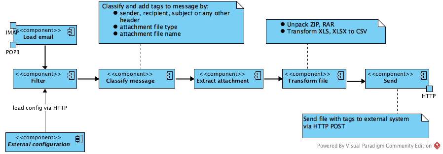
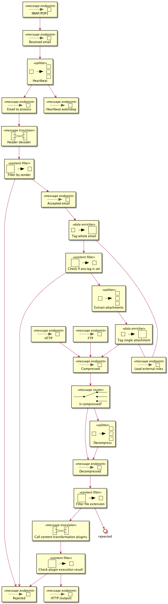

# Mailspider

Quick-and-dirty configurable gmail-compatible ETL
"unpack-process-and-send-to-http".  
**Data sources**: IMAP, POP3, FTP, HTTP.  
**Processing**: zip|rar ( xlsx, xls ) -> csv. Implemented in plugins.  
**Output**: HTTP upload.

Project is sponsored by Partsib.

High-level email processing diagram (for loading via HTTP there're other loading steps):  

Detailed components diagram:  

Detailed [changelist](CHANGES.md) is available.

# License

Sources are available under GNU AGPL 3.0. See [LICENSE](LICENSE)

# Copyright

(C) 2016-2020 by Shamil Gumirov <shamil (dot) g1@gmail (dot) com>.
