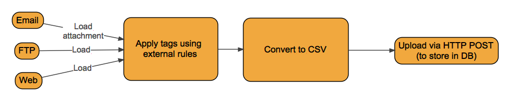

# Mailspider

Configurable gmail-IMAP-compatible ETL to periodically load file/attachment, extract, convert into CSV
(external plugins) and store into DB. It's designed to be extendable at any step. Opensource (see below
for license details).

**Data sources**: IMAP, POP3, FTP, HTTP.  
**Processing**: zip|rar ( xlsx, xls ) -> csv. Implemented in plugins.  
**Output**: HTTP upload.

If you need a new feature, bugfix or any licensing-related questions, feel free to 
[contact me](https://shamil.gumirov.org/about). I'm open to a wide range of collaboration.

## Architecture diagrams and details

High-level email processing diagram (for loading via HTTP there're other loading steps):  

Detailed components diagram:  

Detailed [changelist](CHANGES.md) is available.

# License

Sources are available under GNU AGPL 3.0. See [LICENSE](LICENSE)

# Copyright

(C) 2016-2020 by Shamil Gumirov <shamil (dot) g1@gmail (dot) com>.
